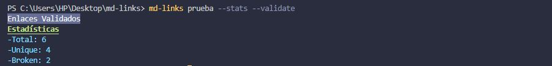

# Markdown Links

## Índice

- [1. Descripción de md-Links](#1-descripción)
- [2. Instalación](#2-instalación)
- [3. Ejemplos de uso](#3-objetivos-de-aprendizaje)
- [4. Sobre el proyecto](#4-consideraciones-generales)
- [5. Plan de acción](#5-criterios-de-aceptación-mínimos-del-proyecto)
- [6. Entregables](#6-entregables)

---

## 1. Descripción general

md-links es una librería creada con JavaScript y Node.js que analiza archivos Markdown ".md" y extrae los enlaces encontrados en ellos. También puede validar el estado de los enlaces y proporciona estadísticas, como el número total de enlaces, enlaces únicos y enlaces rotos.

Consta de dos partes:

### 1) javaScript API

El módulo puede **importarse** en otros scripts de Node.js y ofrece la siguiente interfaz:

#### `mdLinks(path, options)`

##### Argumentos

- `path`: Ruta **absoluta** o **relativa** al **archivo** o **directorio**.
  Si la ruta pasada es relativa, debe resolverse como relativa al directorio
  desde donde se invoca node - _current working directory_).
- `options`: Un objeto con **únicamente** la siguiente propiedad:
  - `validate`: Booleano que determina si se desea validar los links
    encontrados.

##### Valor de retorno

La función **retorna una promesa** (`Promise`) que **resuelva a un arreglo** (`Array`) de objetos (`Object`), donde cada objeto representa un link y contiene
las siguientes propiedades

Con `validate:false` :

- `href`: URL encontrada.
- `text`: Texto que aparecía dentro del link (`<a>`).
- `file`: Ruta del archivo donde se encontró el link.

Con `validate:true` :

- `href`: URL encontrada.
- `text`: Texto que aparecía dentro del link (`<a>`).
- `file`: Ruta del archivo donde se encontró el link.
- `status`: Código de respuesta HTTP.
- `ok`: Mensaje `fail` en caso de fallo u `ok` en caso de éxito.

### 2) CLI (Command Line Interface - Interfaz de Línea de Comando)

Se debe ejecutar de la siguiente manera a través de la **terminal**:

`md-links <path-to-file> [options]`

#### Options

##### `--validate`

Si pasamos la opción `--validate`, el módulo debe hacer una petición HTTP para averiguar si el link funciona o no. Si el link resulta en una redirección a una
URL que responde ok, entonces consideraremos el link como ok.

##### `--stats`

Si pasamos la opción `--stats` el output (salida) será un texto con estadísticas básicas sobre los links.

##### `--stats` y `--validate`

Además, se pueden combinar estas opciones para obtener estadísticas que
necesiten de los resultados de la validación.

## 2. Instalación

Ejecuta el siguiente comando en tu terminal:

`$ npm install -g catherinefc21-md-links`

## 2. Ejemplos de uso

`md-links + Ruta de archivo o directorio`

`md-links + Ruta + --validate`

`md-links + Ruta + --stats`

`md-links + Ruta + --stats + --validate`

## 4. Diagramas de flujo con la lógica de la aplicación

### 1) javaScript API ✔

### 2) Interfaz CLI ✔

## 5. Planificación del proyecto

Uso de [github project](https://github.com/users/catherinefc21/projects/2) para organización de tareas, progreso e hitos.

